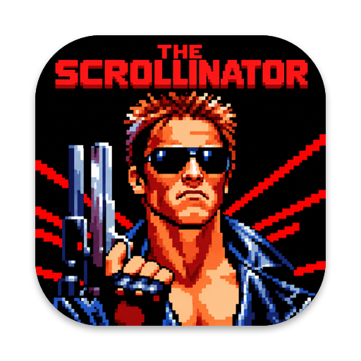
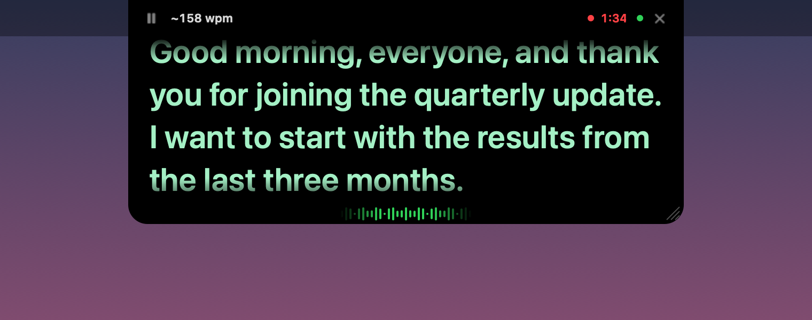
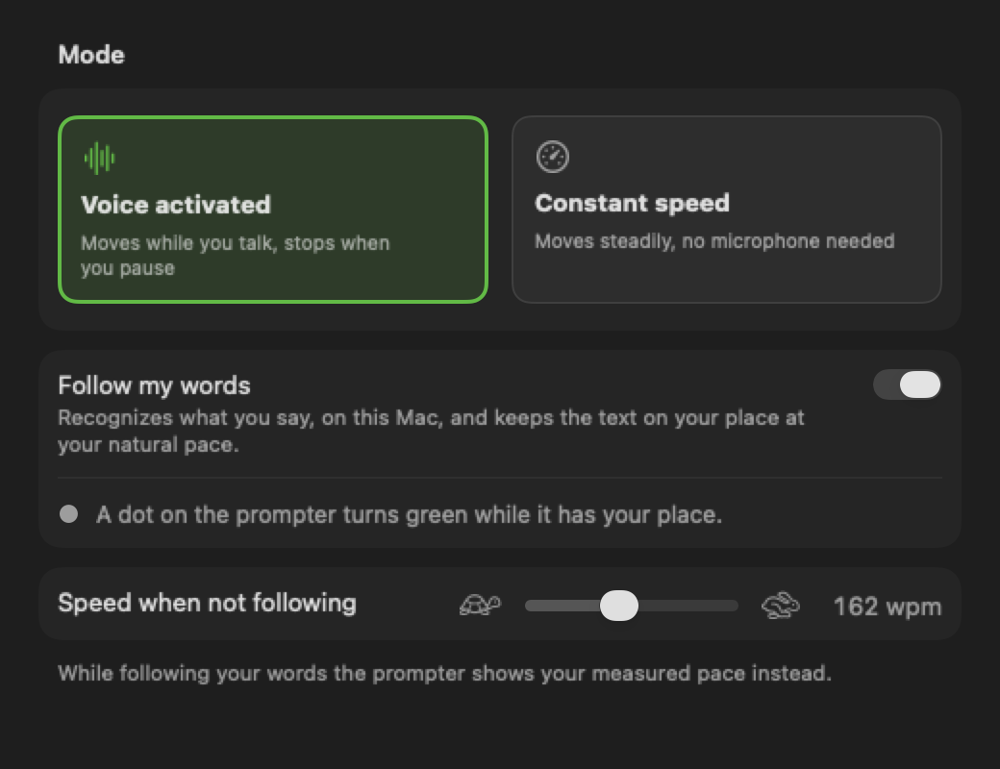
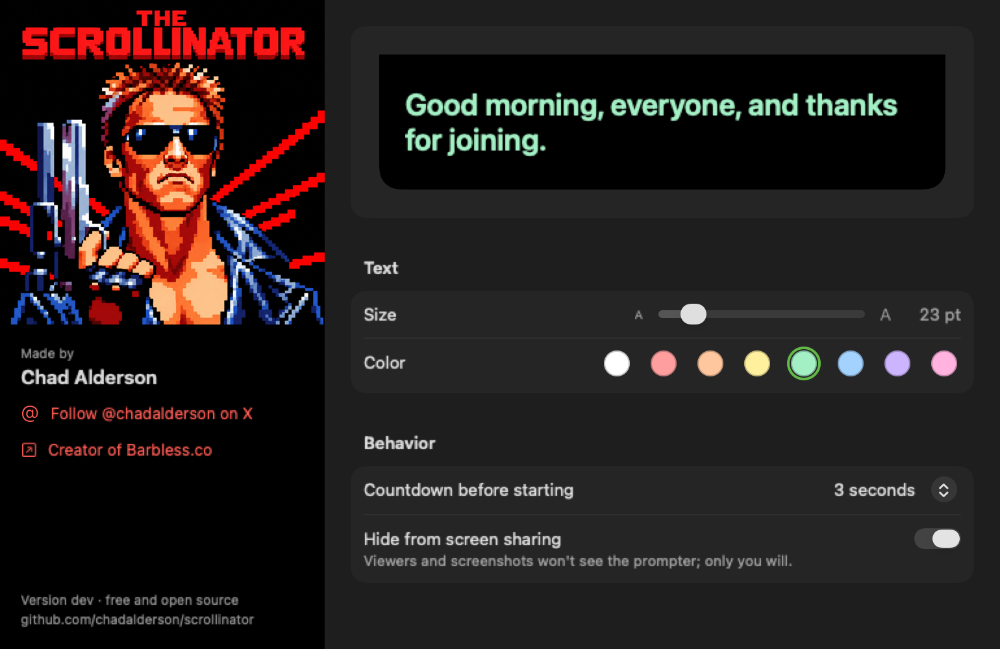

<p align="center">
  
</p>

<h1 align="center">The Scrollinator</h1>

<p align="center">
  <b>A teleprompter for macOS that sits under your camera and follows your voice.</b><br>
  It'll be back… on the line you're reading.
</p>

<p align="center">
  Native Swift · macOS 14+ · Apple Silicon and Intel · no accounts, no tracking · public domain
</p>

<p align="center">
  
</p>

---

The Scrollinator puts your script in a small black panel that hangs from the top of the screen, right
under the camera, so you keep eye contact on calls and recordings. On a MacBook it grows out of the
notch. It listens while you talk, scrolls at your pace, waits when you ad-lib, and is invisible to
screen sharing so only you see it.

There are lots of teleprompter apps. This one is free, open source and public domain. Take it, change
it, ship it.

> **Want it on the Mac App Store?** The project is pretty much plug and play for that:
> `./build.sh appstore` already makes a sandboxed, App Store-ready build, and
> [APP_STORE.md](APP_STORE.md) walks through the rest. I'm too busy to publish it myself, so **please
> do: put out a free version** and share it around.

## Features

### Reads along with you
- **Follow my words.** On-device speech recognition matches what you say to the script and keeps the
  text on your place at your natural pace. Speed up, slow down, get tired, pause: it keeps up instead
  of drifting. A green dot on the prompter shows when it has your place, and the prompter shows your
  live measured pace (`~158 wpm`).
- **Knows when you ad-lib.** Go off script and the text stops within about a line and waits for you.
  Re-read a sentence or skip one and it finds you in about two seconds.
- **Waveform that tells you what it hears.** A small waveform under the text ripples out from the
  center: **green** while your words match the script, white for anything else (ad-libs, coughs,
  crosstalk).
- **Voice-activated scrolling.** Moves while you talk and eases to a stop when you pause, like
  braking a car, then pulls away quickly when you start again.
- **Ignores your keyboard.** Speech detection looks for the pitch and frequency range of a voice and
  sustained sound, so typing and desk taps don't move the text. It also adapts to your room's
  background noise and any microphone, including multichannel interfaces.
- **Constant speed mode** for when you don't want the mic involved, in words per minute.

### Stays out of the way
- **Hidden from screen sharing and screenshots.** Zoom, Meet, Teams and screen recordings don't see
  it.
- **Notch-aware panel.** Sits flush under the camera, or drag it anywhere; drag it near the top and it
  snaps flush again. Resize from the corner.
- **Hover to pause, trackpad to scroll**, and a countdown before it starts.
- **Global shortcuts** that work from any app (below).
- **Menu bar app.** A script editor with word count and reading time, a settings window, and nothing
  in your way.

### Records your sessions (optional)
- Saves your voice for each prompter session, from Start Prompting until you close it: **MP3** in the
  direct build, **AAC (.m4a)** in the App Store build. Mono, 128 kbps, named after the script and time.
- Pick the folder, see the last recording in Finder. A red dot and timer show while it records.

### Private by design
Scripts, settings, audio and recordings stay on your Mac. Speech recognition runs on-device; the only
download is macOS fetching its speech model the first time. No analytics, no accounts.

## Keyboard shortcuts

| Action | Shortcut |
|---|---|
| Play / pause | ⌃⌥ Space |
| Jump back / forward | ⌃⌥ ↑ / ⌃⌥ ↓ |
| Faster / slower (constant speed, or the fallback speed) | ⌃⌥ = / ⌃⌥ − |
| Restart from the top | ⌃⌥ R |
| Show / hide the prompter | ⌃⌥ H |

## Settings

<p align="center">
  
  
</p>

Five tabs: **Prompter** (live preview, size, color, countdown, screen-share hiding), **Scrolling**
(mode, follow my words, speed), **Microphone** (live input meter and sensitivity), **Recording**
(on/off, folder, last recording) and **Shortcuts**.

## Requirements

- **To run:** macOS 14 Sonoma or later, Apple Silicon or Intel.
- **Follow my words** works best on **macOS 26**, which has Apple's newer on-device speech engine
  (it works even with Dictation turned off). On macOS 14–15 it uses the older recognizer, which needs
  Dictation turned on in Keyboard settings; Settings tells you if so. Without either, the prompter
  scrolls by voice level at your set speed.
- **To build:** the macOS 26 SDK, which comes with Xcode 26 or its Command Line Tools
  (`xcode-select --install`). No Xcode project needed; it's a Swift package.

## Build and run

```sh
git clone https://github.com/chadalderson/scrollinator.git
cd scrollinator
./build.sh                 # builds build.noindex/direct/The Scrollinator.app
INSTALL=1 ./build.sh       # ...and copies it to /Applications
```

The first build downloads and compiles the LAME MP3 encoder (about a minute, once). The app is signed
with your Apple Development certificate if you have one, which keeps macOS from asking for microphone
permission again after every rebuild; otherwise it's signed ad hoc.

Then open **The Scrollinator**, click the viewfinder icon in the menu bar, choose **Scripts…**, pick a
script and press **Start Prompting** (⌘↩). Allow microphone and speech recognition when asked.

### Build flavors

| | `./build.sh` (direct) | `./build.sh appstore` |
|---|---|---|
| Sandbox | no | yes |
| Recording format | MP3 (bundled LAME) | AAC .m4a (Apple's encoder) |
| Default recordings folder | ~/Music/Scrollinator Recordings | same |
| Output | `.app` + `.zip` | `.app`, plus a signed `.pkg` for upload once your certificates and profile are set up |
| Distribution | your Macs, or your org with a Developer ID (`SIGN_IDENTITY`, `NOTARY_PROFILE`) | Mac App Store, see [APP_STORE.md](APP_STORE.md) |

`build.sh` documents its environment overrides at the top: `BUNDLE_ID`, `VERSION`, `BUILD_NUMBER`,
`SIGN_IDENTITY`, `NOTARY_PROFILE`, `PROVISIONING_PROFILE`, `INSTALLER_IDENTITY`, `INSTALL`.

## How it works

| File | What it does |
|---|---|
| `PrompterView.swift` | The panel: notch shape, faded text, controls, follow dot, recording timer, waveform |
| `PrompterController.swift` | Shows the panel, runs the 60 Hz scroll loop with take-off and braking, ties everything together |
| `VoiceDetector.swift` | Mic input; speech detection by loudness over an adaptive noise floor, voice-band filtering, pitch (autocorrelation) and sustain |
| `SpeechFollower.swift` | On-device recognition: SpeechAnalyzer on macOS 26, SFSpeechRecognizer before that |
| `ScriptAligner.swift` | Fuzzy-matches the last words heard to the script (Smith-Waterman local alignment) to find your place |
| `PaceFollower.swift` | Blends recognized positions with your measured pace into a smooth scroll speed; holds during ad-libs |
| `SessionRecorder.swift` | Session recording to MP3 (LAME) or M4A (AVFoundation), sandbox-safe folder access |
| `HotKeys.swift` | Global shortcuts via `RegisterEventHotKey` (no Accessibility permission needed) |
| `ScriptStore.swift`, `EditorView.swift` | Scripts saved as JSON in Application Support, and the editor |
| `SettingsView.swift`, `Prefs.swift` | The settings window and stored preferences |
| `scripts/make-icon.swift` | Builds the app icon from `Resources/AppIcon.png`, or draws a pixel-art robot if that file is missing |

In development tests with synthesized speech whose pace swung between 140 and 220 wpm, following kept
the text within about 1.5 words of the speaker on average, against about 9.4 words and growing drift
at a fixed speed.

## Contributing

Issues and pull requests are welcome, though I may be slow to respond. You don't need permission for
anything: fork it, rename it, sell it, ship it.

## License

[The Unlicense](LICENSE): public domain. Do whatever you want with it.

The one exception is the **LAME** MP3 encoder (LGPL), which isn't in this repository:
`scripts/build-lame.sh` downloads and compiles it, and only the direct build links it. The App Store
build doesn't use it at all.

## Credits

Inspired by [Moody](https://moody.mjarosz.com). The name and the 16-bit icon are a parody of, and an
affectionate nod to, a certain 1984 movie about a very persistent cyborg. No affiliation with or
endorsement by anyone involved.

**Publishing your own copy?** Swap the icon first: the App Store rejects apps that use a real
person's likeness without permission. Delete `Resources/AppIcon.png` and the build falls back to an
original pixel-art robot icon drawn by `scripts/make-icon.swift`, or drop in your own square PNG.
