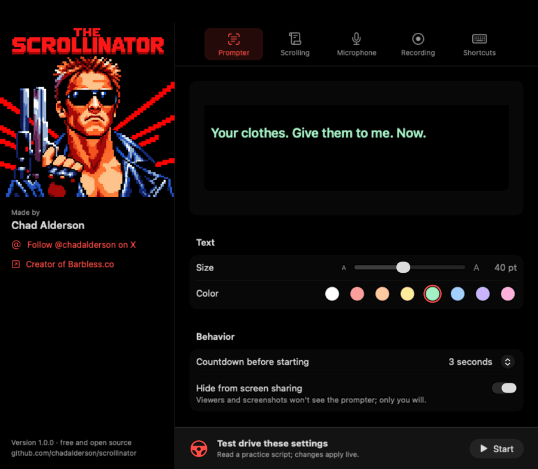
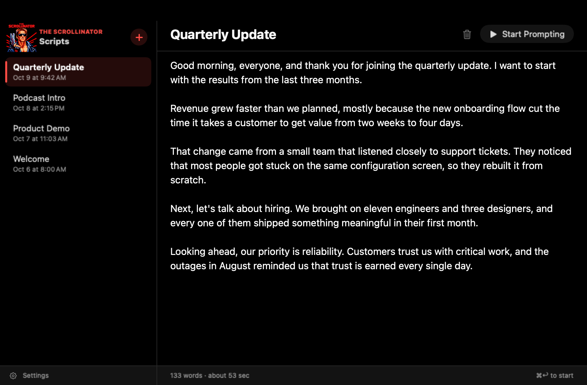
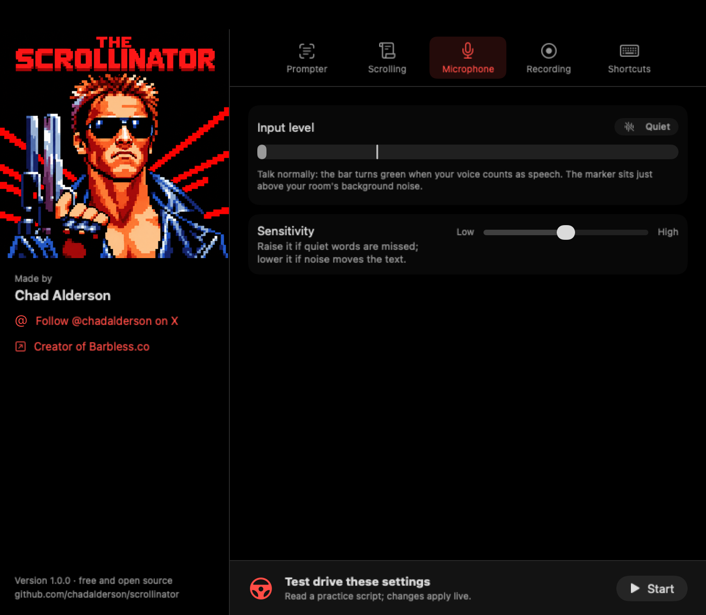
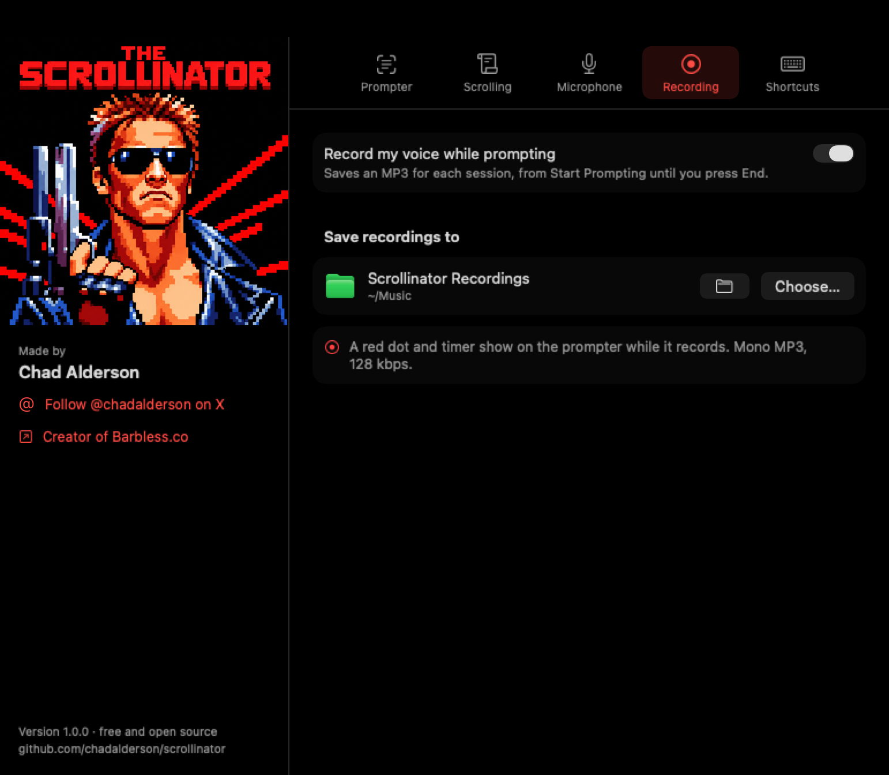
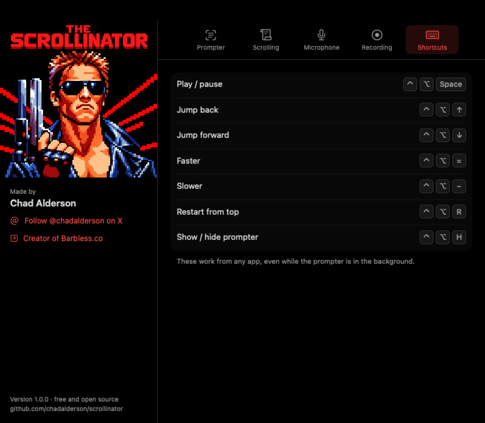
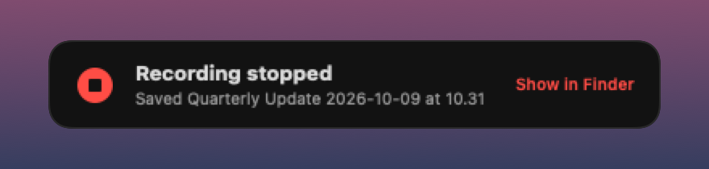

<p align="center">
  
</p>

<h1 align="center">The Scrollinator</h1>

<p align="center">
  <b>A teleprompter for macOS that sits under your camera and follows your voice.</b><br>
  It'll be back… on the line you're reading.
</p>

<p align="center">
  Native Swift · macOS 14+ · Apple Silicon and Intel · no accounts, no tracking · public domain
</p>

<p align="center">
  
</p>

---

The Scrollinator puts your script in a small black panel that hangs from the top of the screen, right
under the camera, so you keep eye contact on calls and recordings. On a MacBook it grows out of the
notch. It listens while you talk, scrolls at your pace, waits when you ad-lib, and is invisible to
screen sharing so only you see it.

There are lots of teleprompter apps. This one is free, open source and public domain. Take it, change
it, ship it.

> **Want it on the Mac App Store?** The project is pretty much plug and play for that:
> `./build.sh appstore` already makes a sandboxed, App Store-ready build, and
> [APP_STORE.md](APP_STORE.md) walks through the rest. I'm too busy to publish it myself, so **please
> do: put out a free version** and share it around.

## Contents

- [Features](#features)
- [Screenshots](#screenshots)
- [Run it locally](#run-it-locally)
- [Using it](#using-it)
- [Keyboard shortcuts](#keyboard-shortcuts)
- [Troubleshooting](#troubleshooting)
- [Build flavors and distribution](#build-flavors-and-distribution)
- [How it works](#how-it-works)
- [Testing tracking](#testing-tracking)
- [License](#license) and [credits](#credits)

## Features

### Reads along with you
- **Follow my words.** On-device speech recognition matches what you say to the script and keeps the
  text on your place at your natural pace. Speed up, slow down, get tired, pause: it keeps up instead
  of drifting. A green dot on the prompter shows when it has your place, and the prompter shows your
  live measured pace (`~158 wpm`).
- **Knows when you ad-lib.** Go off script and the text holds within about a line and waits for you.
  Re-read a sentence or skip one and it finds you in about two seconds.
- **Waveform that tells you what it hears.** A small waveform under the text ripples out from the
  center: **green** while your words match the script, white for anything else (ad-libs, coughs,
  crosstalk).
- **Smooth, car-like motion.** The text pulls away quickly when you start talking and brakes to a
  stop when you pause.
- **Ignores your keyboard.** Speech detection looks for the pitch, frequency range and steadiness of a
  voice, so typing and desk taps don't move the text. It adapts to your room's background noise and
  any microphone, including multichannel interfaces like a RØDECaster.
- **Works at any size.** Tracking runs in words, not screen distance, so it stays accurate from a
  tiny prompter to a huge one, and you keep your place when you change the text size or prompter
  width mid-read.
- **Constant speed mode** in words per minute, for when you don't want the mic involved.

### Dial it in
- **Test drive.** The Prompter, Scrolling and Microphone settings have a **Test drive** button that
  opens the real prompter with a short practice scene (the Scrollinator, sent back in time to save
  your presentation) while Settings stays open. Change the size, color, speed or sensitivity and feel
  it as you read. Test drives are never recorded.
- **True-to-size preview.** Settings shows your prompter in miniature at its real proportions, so you
  see exactly how big the text will be and where lines wrap.
- **Pastel text colors** picked to read well on black, and text from 16 to 72 pt.
- **Adjust speed from the prompter** with − and + (1 wpm steps, hold to repeat) when you're not using
  Follow my words.

### Stays out of the way
- **Hidden from screen sharing and screenshots.** Zoom, Meet, Teams and screen recordings don't see
  it. (Turn it off in Settings if you need a screenshot of it.)
- **Notch-aware panel.** Sits flush under the camera, or drag it anywhere; drag it near the top and it
  snaps flush again. Resize from the corner.
- **Hover to pause, trackpad to scroll**, and an optional countdown before it starts.
- **One clear End button** that closes the prompter and stops any recording.
- **Global shortcuts** that work from any app.
- **Menu bar app** with a black-and-red Scripts window and Settings to match.

### Records your sessions (optional)
- Saves your voice for each prompter session, from Start Prompting until you press End: **MP3** in
  the direct build, **AAC (.m4a)** in the App Store build. Mono, 128 kbps, named after the script and
  time, in `~/Music/Scrollinator Recordings` or any folder you pick.
- A red dot and timer show while it records. When it stops, a message confirms it and shows the
  saved file; click it to see the file in Finder.

### Private by design
Scripts, settings, audio and recordings stay on your Mac. Speech recognition runs on-device; the only
download is macOS fetching its speech model the first time. No analytics, no accounts.

## Screenshots

**The prompter:** hangs from the notch, with End, pause, the recording timer, your live pace and the
follow dot along the top, and the waveform underneath.

<p align="center">
  
</p>

**Scripts:** write and pick scripts, then Start Prompting (⌘↩).

<p align="center">
  
</p>

**Settings:** five tabs beside the artwork and credits. Prompter, Scrolling and Microphone each have a
Test drive button.

<table>
  <tr>
    <td align="center" width="50%"><br><b>Prompter</b>: true-to-size preview, size, color, countdown, screen-share hiding</td>
    <td align="center" width="50%"><br><b>Scrolling</b>: voice or constant speed, Follow my words, fallback speed</td>
  </tr>
  <tr>
    <td align="center"><br><b>Microphone</b>: live input meter and sensitivity</td>
    <td align="center"><br><b>Recording</b>: on/off and where recordings go</td>
  </tr>
  <tr>
    <td align="center"><br><b>Shortcuts</b>: global shortcuts as keycaps</td>
    <td align="center"><br>When a recording stops, a message confirms it</td>
  </tr>
</table>

## Run it locally

### 1. Get the tools (one time)

You need **macOS 26** with **Xcode 26 or its Command Line Tools** to build (the app itself runs on
macOS 14 or later). There's no Xcode project; it's a Swift package and a build script.

```sh
xcode-select --install   # Command Line Tools, if you don't have Xcode
swift --version          # should say Swift 6.2 or later, targeting macOS 26
```

### 2. Build and install

```sh
git clone https://github.com/chadalderson/scrollinator.git
cd scrollinator
INSTALL=1 ./build.sh
```

That builds a universal app (Apple Silicon and Intel) and copies it to `/Applications/The
Scrollinator.app`. Leave off `INSTALL=1` to just build it into `build.noindex/direct/`.

- The first build downloads and compiles the LAME MP3 encoder (about a minute, once; needs the
  internet). Later builds take seconds.
- If you have an **Apple Development** certificate in your keychain (any free Apple ID signed into
  Xcode gives you one), the build signs with it automatically. That keeps macOS from asking for
  microphone permission again after every rebuild. Without one it signs ad hoc, which works fine but
  re-asks after each build.

### 3. First launch

1. Open **The Scrollinator** from Applications or Spotlight. A viewfinder icon appears in the menu
   bar and the **Scripts** window opens.
2. Pick the **Welcome** script, or click **+** to write your own, and press **Start Prompting** (⌘↩).
3. Allow **Microphone** and **Speech Recognition** when macOS asks.
4. The first time you use Follow my words, macOS downloads its speech model (about a minute); the
   follow dot stays gray until it's ready.

### 4. Updating

```sh
git pull
INSTALL=1 ./build.sh
```

Quit the app first (menu bar icon → Quit), then reopen it after the build.

### Where your stuff lives

| What | Where |
|---|---|
| Scripts | `~/Library/Application Support/Scrollinator/scripts.json` |
| Settings | `defaults read com.chadalderson.scrollinator` |
| Recordings | `~/Music/Scrollinator Recordings` (or the folder you chose) |

To uninstall, quit the app and delete it from Applications, plus any of the above you don't want.

## Using it

- **Menu bar icon:** show or hide the prompter, play or pause, restart, open Scripts or Settings, open
  the recordings folder, quit.
- **Scripts window:** your scripts on the left (right-click to delete), the editor on the right with
  word count and reading time, and **Start Prompting** (⌘↩). The gear at the bottom left opens
  Settings.
- **The prompter's top bar,** left to right: **End** (finish the session), **play/pause**, the
  **recording timer** (centered, or beside pause under a notch), then your **pace** and the **follow
  dot** on the right.
- **Settings:** Prompter (preview, size, color, countdown, screen-share hiding), Scrolling (voice or
  constant speed, Follow my words, speed), Microphone (input meter, sensitivity), Recording (on/off,
  folder, last recording) and Shortcuts. Prompter, Scrolling and Microphone each have **Test drive**.

## Keyboard shortcuts

These work from any app, even while the prompter is in the background.

| Action | Shortcut |
|---|---|
| Play / pause | ⌃⌥ Space |
| Jump back / forward | ⌃⌥ ↑ / ⌃⌥ ↓ |
| Faster / slower (constant speed, or the fallback speed) | ⌃⌥ = / ⌃⌥ − |
| Restart from the top | ⌃⌥ R |
| Show / hide the prompter | ⌃⌥ H |

In the Scripts window: ⌘N new script, ⌘↩ start prompting, ⌘, Settings.

## Troubleshooting

- **The text doesn't move when I talk.** Check Settings → Microphone: the bar should turn green when
  you speak. If it doesn't, raise Sensitivity; if noise moves the text, lower it. If it says
  microphone access is off, use the button there to turn it on in System Settings.
- **The follow dot never turns green.** Settings → Scrolling says why: speech recognition permission
  is off, the model is still downloading, or (on macOS 14–15) Dictation needs to be turned on.
- **I can't screenshot the prompter.** That's "Hide from screen sharing" doing its job; turn it off in
  Settings → Prompter while you take the screenshot.
- **macOS keeps asking for microphone permission.** You're on an ad-hoc signed build; sign in to
  Xcode with your Apple ID once so you get an Apple Development certificate, then rebuild.
- **A friend can't open the app I sent them.** Builds signed for your own Mac aren't trusted
  elsewhere. Distribute with a Developer ID certificate and notarization (see below), or they can
  right-click the app → Open.
- **Want to see what recognition hears?** Run
  `SCROLLINATOR_DEBUG_SPEECH=1 "/Applications/The Scrollinator.app/Contents/MacOS/Scrollinator"` from
  Terminal.

## Build flavors and distribution

| | `./build.sh` (direct) | `./build.sh appstore` |
|---|---|---|
| Sandbox | no | yes |
| Recording format | MP3 (bundled LAME) | AAC .m4a (Apple's encoder) |
| Default recordings folder | ~/Music/Scrollinator Recordings | same |
| Output | `.app` + `.zip` | `.app`, plus a signed `.pkg` for upload once your certificates and profile are set up |
| Distribution | your Macs, or your org with a Developer ID (`SIGN_IDENTITY`, `NOTARY_PROFILE`) | Mac App Store, see [APP_STORE.md](APP_STORE.md) |

`build.sh` documents its environment overrides at the top: `BUNDLE_ID`, `VERSION`, `BUILD_NUMBER`,
`COPYRIGHT`, `SIGN_IDENTITY`, `NOTARY_PROFILE`, `PROVISIONING_PROFILE`, `INSTALLER_IDENTITY`,
`INSTALL`.

## How it works

| File | What it does |
|---|---|
| `PrompterView.swift` | The panel: notch shape, faded text, End and play buttons, recording timer, pace, follow dot, waveform |
| `PrompterController.swift` | Shows the panel and runs the 60 Hz scroll loop; ties voice, recognition, recording and layout together |
| `VoiceDetector.swift` | Mic input; speech detection by loudness over an adaptive noise floor, voice-band filtering, pitch (autocorrelation) and sustain |
| `SpeechFollower.swift` | On-device recognition: SpeechAnalyzer on macOS 26, SFSpeechRecognizer before that |
| `ScriptAligner.swift` | Fuzzy-matches the last words heard to the script (Smith-Waterman local alignment) to find your place, without letting old matches vouch for far jumps |
| `PaceFollower.swift` | Predicts your position in words from what was recognized and your measured pace; holds during ad-libs |
| `WordLayout.swift` | Where every word sits in the current layout, so following works in words at any size and you keep your place through font or width changes |
| `ScrollMotion.swift` | One frame of motion: quick take-off, braking, and following (shared by the app and the tracking test) |
| `SessionRecorder.swift`, `StatusToast.swift` | Session recording to MP3 (LAME) or M4A (AVFoundation) with sandbox-safe folders, and the "Recording stopped" message |
| `HotKeys.swift` | Global shortcuts via `RegisterEventHotKey` (no Accessibility permission needed) |
| `ScriptStore.swift`, `EditorView.swift` | Scripts saved as JSON in Application Support, and the Scripts window |
| `SettingsView.swift`, `Prefs.swift` | The Settings window, test drive, and stored preferences |
| `scripts/make-icon.swift` | Builds the app icon from `Resources/AppIcon.png`, or draws a pixel-art robot if that file is missing |

## Testing tracking

`Tests/Tracking/run.sh` checks that **Follow my words** stays on the speaker at every prompter size.
macOS text-to-speech reads the practice script at speeds from 140 to 220 wpm; the audio goes through
the app's real speech recognition once, and that recording is replayed through the app's real layout
and scrolling code at 25 sizes (300×120 to 1400×400, 16 to 72 pt) plus font and width changes
mid-read. A second run adds an ad-lib, a re-read and a skip. It prints how far the reading line
strays from the speaker and PASS or FAIL.

```sh
Tests/Tracking/run.sh          # replay the saved recordings (fast)
Tests/Tracking/run.sh record   # re-record first (about 3.5 minutes; needs macOS 26)
```

Typical results: within about 1 word on average at every size, ending exactly on the last word;
after a re-read or skip it's back on the speaker's line within about 2.5 seconds.

## Contributing

Issues and pull requests are welcome, though I may be slow to respond. You don't need permission for
anything: fork it, rename it, sell it, ship it. If you change recognition, the matcher or scrolling,
run `Tests/Tracking/run.sh record` before and after.

## License

[The Unlicense](LICENSE): public domain. Do whatever you want with it.

The one exception is the **LAME** MP3 encoder (LGPL), which isn't in this repository:
`scripts/build-lame.sh` downloads and compiles it, and only the direct build links it. The App Store
build doesn't use it at all.

## Credits

Made by Chad Alderson ([@chadalderson on X](https://x.com/chadalderson)), creator of
[Barbless.co](https://barbless.co). The name and the 16-bit icon are a parody of, and an affectionate
nod to, a certain 1984 movie about a very persistent cyborg. No affiliation with or endorsement by
anyone involved.

**Publishing your own copy?** Swap the icon first: the App Store rejects apps that use a real
person's likeness without permission. Delete `Resources/AppIcon.png` and the build falls back to an
original pixel-art robot icon drawn by `scripts/make-icon.swift`, or drop in your own square PNG.
